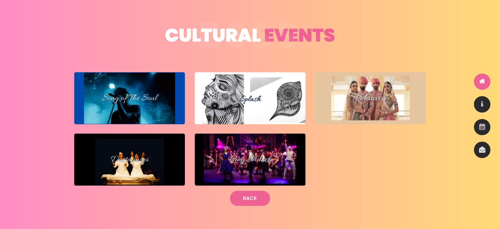

## Abhisaran
This is the official site of Abhisaran (BSSS Bhopal). Abhisaran is the cultural fest of BSSS Bhopal. The website was to let people know about the fest, and various events in the fest. 

### Description :
The website was divided into various pages :

- **Home Page :**  It is the main page of website.

- **About-Us Page :** This page had all the information about Abhisaran, along with the brochure and event timeline.

- **Events page :** This page had information of all the events which were to be held in Abhisaran, the page was different catagories, on clicking the catogories , it displays all the events of that particular category. If any of the event is clicked a carousel is opened with all the information about the event,and the link to register. On clicking the registration link the user is taken to the registration form (which was used by the officials for managing the event).

")

- **Contact-Us Page :** On the page the user can drop any message/query, the message is sent through the mail to the concerned authorities. It was made using the smtplib module which provides a mail sending interface

The complete website was responsive for all devices.

### Tech stack / Framework used : 
The backend of the webapp is made using Django Framework. For styling and ehancing the look Bootstrap , CSS and Javascript is used.
**Deployment :** The website was hosted and deployed on herouku, along with it a custom domain was used to point to the website.

### Contributor :

<!-- readme: contributors -start -->
<table>
<tr>
    <td align="center">
        <a href="https://github.com/manan2110">
            
             
            <b>Manan Gyanchandani</b>
        </a>
    </td>
    <td align="center">
        <a href="https://github.com/bsssabhisaran">
            
             
            <b>Bsssabhisaran</b>
        </a>
    </td></tr>
</table>
<!-- readme: contributors -end -->

